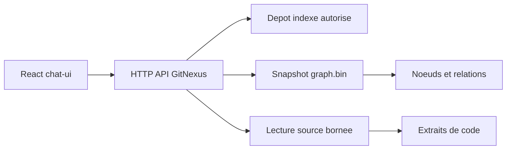
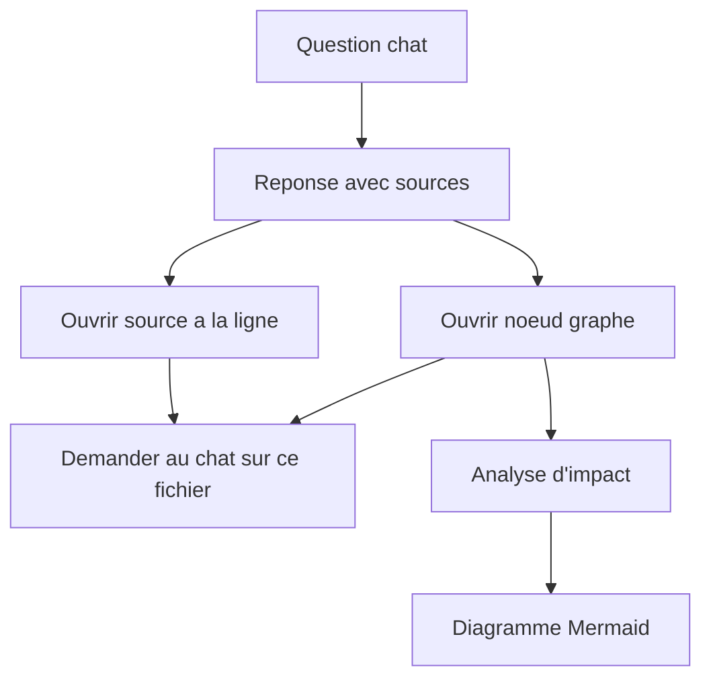

# Navigation React dans les sources et le graphe

Derniere mise a jour: 2026-05-07

## Reponse courte

Oui. GitNexus peut maintenant commencer a naviguer dans les sources et dans le graphe depuis le client React autonome `chat-ui`.

La premiere version web expose un panneau `Explorer` dans le chat:

- onglet `Sources`: arborescence read-only, filtre, apercu source avec numeros de lignes;
- onglet `Graphe`: recherche de symboles, voisinage graphe, carte SVG cliquable;
- citations source du chat: les chemins `foo/bar.cs:42` deviennent cliquables;
- rebond vers le chat: un fichier ou un noeud peut alimenter le brouillon de question.

Cette surface reste volontairement bornee: le navigateur passe par des endpoints HTTP read-only, et le backend refuse les chemins qui sortent du depot indexe.

## Etat actuel

### Desktop React/Tauri

Le desktop contient deja les briques principales:

| Fonction | Surface existante |
| --- | --- |
| Arborescence des fichiers | `crates/gitnexus-desktop/ui/src/components/files/FileTreeView.tsx` |
| Apercu source avec coloration | `crates/gitnexus-desktop/ui/src/components/files/FilePreview.tsx` |
| Graphe interactif | `crates/gitnexus-desktop/ui/src/components/graph/GraphExplorer.tsx` |
| Voisinage d'un noeud | `get_subgraph` cote Tauri |
| Recherche de symboles | `search_symbols` cote Tauri |
| Clic depuis le chat vers le graphe | `ChatMarkdown.tsx` et `ChatMode.tsx` |
| Mode explorateur combine | `crates/gitnexus-desktop/ui/src/components/explorer/ExplorerMode.tsx` |

Les commandes Tauri cote Rust existent aussi:

- `get_file_tree`
- `get_file_content`
- `get_graph_data`
- `get_subgraph`
- `search_symbols`
- `get_impact_analysis`

Conclusion: pour le desktop, la navigation sources + graphe est deja presente et peut etre amelioree.

### Chat React autonome (`chat-ui`)

Le client web autonome est centre sur la conversation et possede maintenant un premier espace d'exploration:

- selection de projet indexe;
- streaming `/api/chat`;
- rendu Markdown;
- rendu Mermaid;
- coloration syntaxique;
- exports Markdown/PDF avec metadata projet/LLM/date, code, tables, citations source et fallback Mermaid;
- diagnostics backend.
- bouton `Explorer`;
- recherche rapide `Ctrl+K` sur fichiers et symboles;
- navigation dans l'arbre des fichiers;
- lecture d'extraits source;
- recherche de symboles;
- voisinage graphe avec carte SVG cliquable.

Les citations de fichiers simples dans les reponses du chat sont deja reliees a cet explorateur. La prochaine amelioration consiste a enrichir les citations avec les symboles et le graphe quand le backend fournit un `node_id`.

### Site HTML genere

Le site de documentation genere offre deja une navigation documentaire, une Carte du Code statique, des liens de sources, Mermaid et le chat de documentation. Il reste oriente "documentation exportee", pas "exploration live du graphe".

## Principe d'integration

Le navigateur ne doit jamais lire `D:\...` ou `C:\...` directement. La bonne architecture est:



Le backend connait les depots indexes, normalise les chemins, refuse les traversals (`..`) et renvoie uniquement des donnees liees au repo selectionne.

## UX cible

Ajouter un espace de travail a onglets dans `chat-ui`:

```text
Chat | Sources | Graphe | Recherche
```

### Onglet Chat

Le chat reste l'ecran principal. Les ameliorations attendues:

- les citations de fichiers deviennent cliquables;
- `Ctrl+K` ouvre une palette pour rejoindre rapidement un fichier ou un symbole;
- un clic sur `Controllers/CourrierController.cs:120` ouvre l'onglet Sources a la bonne ligne;
- un clic sur un symbole inline ouvre le noeud correspondant dans le Graphe;
- une selection dans Sources ou Graphe peut etre envoyee au chat avec "poser une question sur cette selection".

### Onglet Sources

Disposition recommandee:

```text
Arborescence fichiers | Code source | Outline symboles / contexte graphe
```

Fonctions:

- arbre de fichiers filtre par recherche;
- preview read-only avec numeros de ligne et coloration;
- ouverture directe a une ligne ou plage de lignes;
- liens vers symboles detectes dans le graphe;
- copie du chemin relatif;
- bouton "Demander au chat".

### Onglet Graphe

Disposition recommandee:

```text
Filtres / lenses | Graphe interactif | Inspecteur de noeud
```

Fonctions:

- vue voisinage autour d'un noeud;
- profondeur 1/2/3;
- filtres par type de noeud et relation;
- recherche de symbole;
- "ouvrir le fichier";
- "analyse d'impact";
- "generer diagramme Mermaid";
- "demander au chat".

### Recherche globale

Une palette `Ctrl+K` devrait chercher:

- fichiers;
- classes;
- methodes;
- actions MVC;
- services;
- repositories;
- noeuds du graphe;
- pages de documentation generees.

## API HTTP pour `chat-ui`

La surface web reste petite et read-only au depart.

| Endpoint | Role | Statut |
| --- | --- | --- |
| `GET /api/repos` | Liste des projets indexes | existant |
| `GET /api/repos/{repo}/files?path=` | Arborescence bornee au repo | implemente |
| `GET /api/repos/{repo}/source?path=&start=&end=` | Lecture d'un fichier ou extrait | implemente |
| `GET /api/repos/{repo}/symbols?q=&limit=` | Recherche de symboles | implemente |
| `GET /api/repos/{repo}/graph?zoom=&max_nodes=` | Graphe global limite | implemente |
| `GET /api/repos/{repo}/graph/neighborhood?node_id=&depth=` | Sous-graphe autour d'un noeud | implemente |
| `GET /api/repos/{repo}/context?node_id=` | Callers, callees, imports, communaute | a faire |
| `GET /api/repos/{repo}/impact?node_id=&direction=&depth=` | Impact amont/aval | a faire |

La premiere implementation peut reutiliser les memes types que le desktop:

- `FileTreeNode`
- `FileContent`
- `CytoNode`
- `CytoEdge`
- `GraphPayload`
- `SearchResult`
- `SymbolContext`

## Securite minimale requise

Avant d'exposer les sources au navigateur:

- accepter uniquement un `repo` connu par `/api/repos`;
- convertir les ids publics en chemins internes cote serveur;
- canonicaliser `repo_root + path`;
- refuser tout chemin qui sort du repo;
- ne jamais renvoyer de chemin absolu si `repoPathsExposed` est desactive;
- limiter la taille des fichiers lus;
- limiter `max_nodes` et la profondeur des graphes;
- garder CORS strictement local;
- journaliser sans secrets ni tokens.

## Plan d'implementation

### Phase 1: API read-only source/graphe

Ajouter les endpoints HTTP read-only dans `gitnexus serve` en reutilisant les fonctions deja presentes cote Tauri quand c'est possible.

Statut: fait pour `files`, `source`, `symbols`, `graph` et `graph/neighborhood`.

Validation:

- tests unitaires path traversal;
- tests sur repo indexe minimal;
- tests `GET /api/repos`, `files`, `source`, `symbols`, `neighborhood`.

### Phase 2: citations cliquables dans le chat

Transformer les sources et chemins de fichier dans les reponses en actions:

- ouvrir fichier;
- ouvrir symbole dans graphe;
- copier chemin;
- envoyer au chat.

Statut: fait pour les chemins source simples avec ligne ou plage de lignes. Les liens symbole -> graphe restent a brancher quand la reponse contient un identifiant de noeud exploitable.

Validation:

- tests React sur `Markdown`;
- test d'une reponse contenant `foo/bar.cs:42`;
- pas de boucle de render.

### Phase 3: onglet Sources

Construire une version web de `FileTreeView` + `FilePreview`:

- API HTTP au lieu de Tauri IPC;
- virtualisation si gros arbre;
- preservation de l'etat par repo.

Statut: premiere version livree dans le panneau `Explorer`. La virtualisation gros arbre reste a ajouter.

Validation:

- arbre vide;
- gros arbre;
- fichier introuvable;
- fichier trop volumineux;
- affichage mobile.

### Phase 4: onglet Graphe

Porter le coeur de `GraphExplorer` en version web:

- commencer par le voisinage d'un noeud plutot que le graphe complet;
- limiter a 200 noeuds par defaut;
- lazy expand sur double-clic;
- inspecteur de noeud a droite.

Statut: premiere version livree avec recherche symbole, voisinage et carte SVG cliquable. Le lazy expand et les filtres relationnels restent a ajouter.

Validation:

- graphe vide;
- noeud sans relations;
- limite `max_nodes`;
- focus depuis un lien de chat.

### Phase 5: experience unifiee

Relier les trois surfaces:



Le resultat attendu ressemble davantage a DeepWiki: on lit une reponse, on clique dans les preuves, on navigue dans le graphe, puis on relance une question contextualisee.

## Reutilisation recommandee

Priorite de reutilisation:

1. Reprendre les types de `tauri-commands.ts` dans un module web API separe.
2. Extraire les composants purs quand ils ne dependent pas de Tauri.
3. Garder deux adaptateurs:
   - `desktopAdapter` pour Tauri IPC;
   - `webAdapter` pour HTTP.
4. Ne pas dupliquer la logique de securite cote frontend: le backend reste l'autorite.

Fichiers candidats:

- `crates/gitnexus-desktop/ui/src/components/files/FileTreeView.tsx`
- `crates/gitnexus-desktop/ui/src/components/files/FilePreview.tsx`
- `crates/gitnexus-desktop/ui/src/components/graph/GraphExplorer.tsx`
- `crates/gitnexus-desktop/ui/src/components/graph/NodeHoverCard.tsx`
- `crates/gitnexus-desktop/ui/src/lib/graph-adapter.ts`
- `crates/gitnexus-desktop/ui/src/components/chat/ChatMarkdown.tsx`
- `chat-ui/src/components/ui/Markdown.tsx`

## Decision conseillee

Commencer par `chat-ui`, pas par une fusion complete avec le desktop.

Raison:

- le chat web est deja l'interface que Patrice teste sur `localhost:5174/5176`;
- le besoin immediat est de cliquer les sources d'une reponse;
- un explorateur read-only HTTP est plus simple a securiser qu'un portage complet de Tauri;
- le desktop peut rester la surface avancee pendant que le web gagne les fonctions essentielles.

## Critere de succes

Une premiere version est satisfaisante quand:

- une question chat cite des fichiers;
- un clic ouvre le fichier a la bonne ligne;
- un clic sur un symbole ouvre son voisinage graphe;
- le graphe permet de revenir au source;
- la selection source/graphe peut etre envoyee au chat;
- le backend refuse les chemins hors repo;
- le tout fonctionne sur un projet ASP.NET MVC indexe comme Alise_v2.
