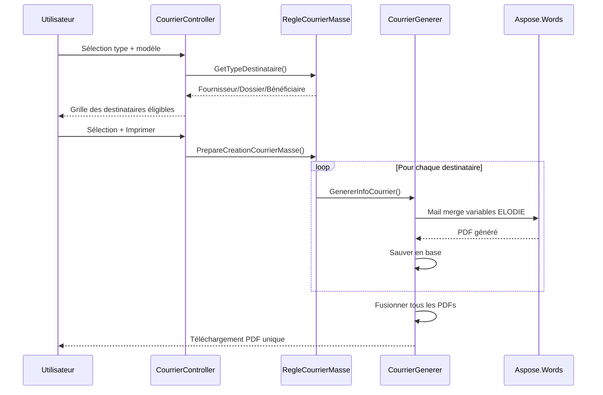
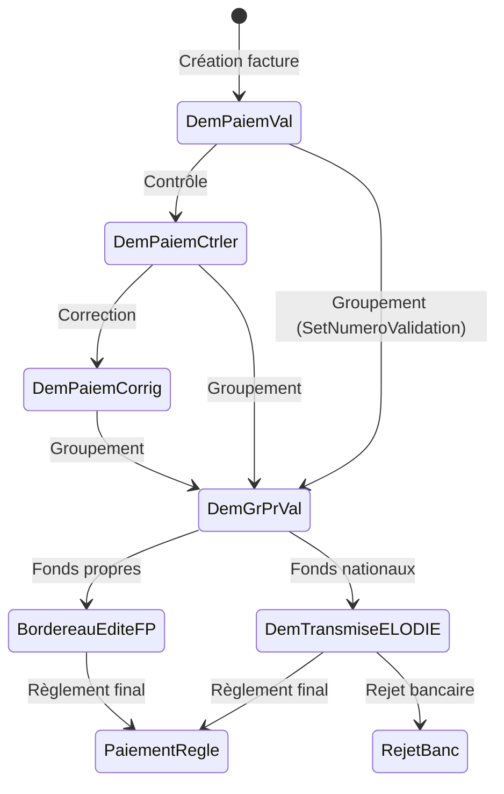
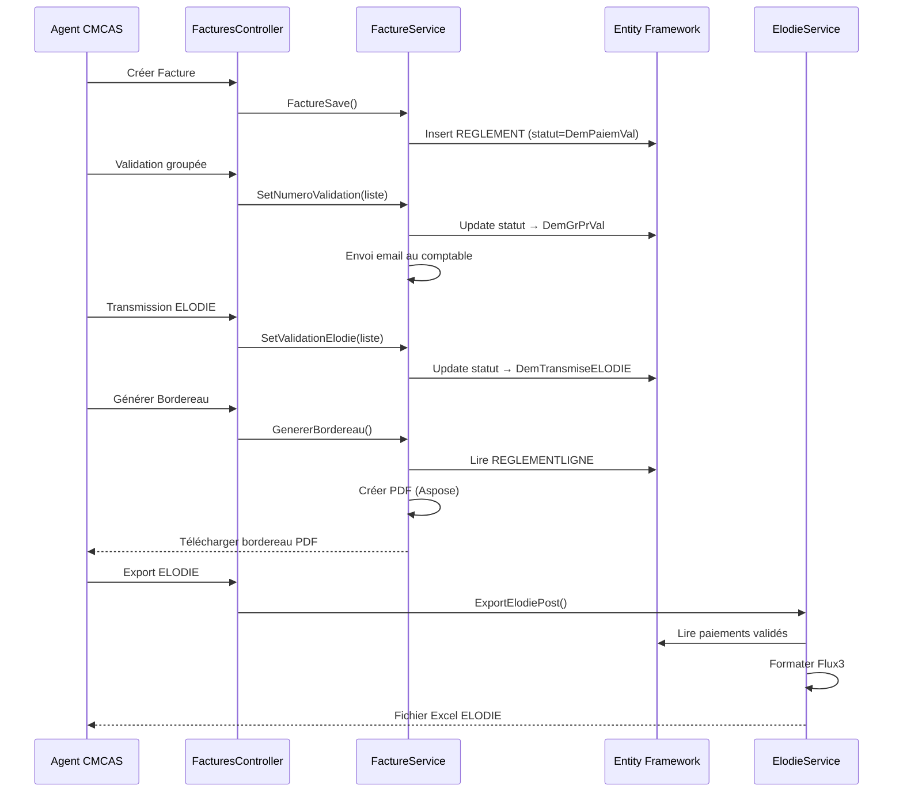
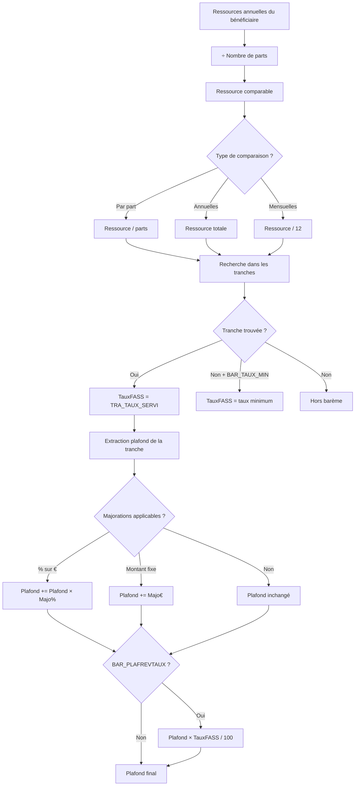
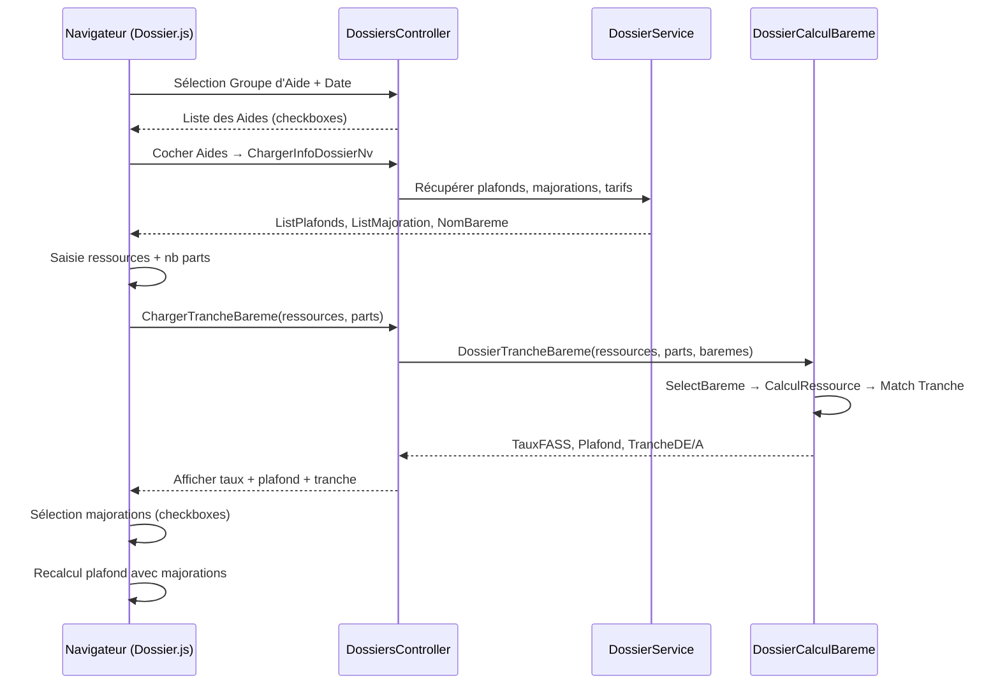
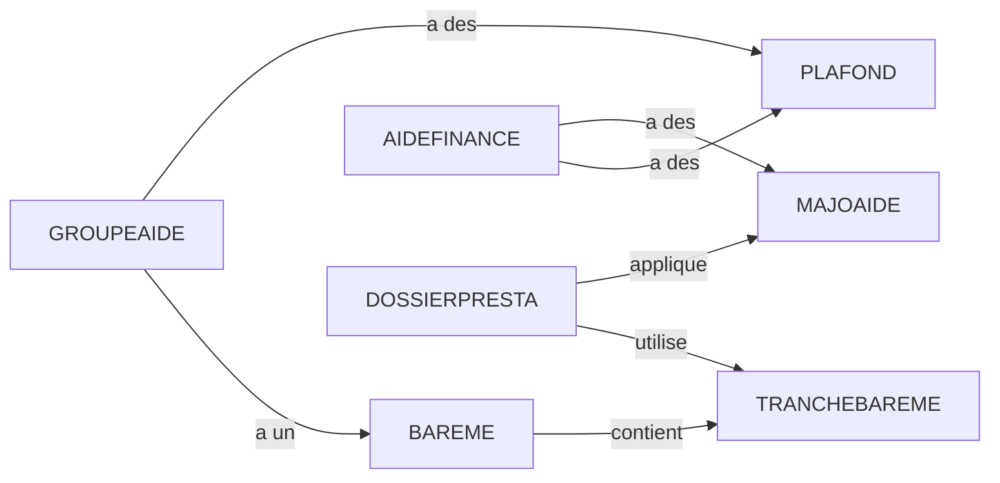

# TODO — Rapport HTML : Atteindre le niveau DeepWiki

> Analyse approfondie basée sur : DeepWiki-Open (Cognition), Code Buddy (grok-cli),
> Docusaurus 3, Starlight (Astro), VitePress, MkDocs Material, Nextra 4, Fumadocs.
> Objectif : transformer la doc générée en une documentation de qualité professionnelle.

---

## Comment fonctionne l'enrichissement LLM chez les concurrents

### Le pipeline Code Buddy (4 phases)

```
Phase 1: DISCOVER → Analyse le graphe, détecte l'architecture, calcule le PageRank
Phase 2: PLAN     → Génère un plan de 30 pages adapté au projet (LLM ou déterministe)
Phase 3: GENERATE → Produit chaque page avec un template par type + enrichissement LLM
Phase 4: LINK     → Crée les cross-références entre concepts (aliases, "See also", "Referenced by")
```

**L'enrichissement LLM (Phase 3) fonctionne ainsi :**

1. La page est d'abord générée avec des données brutes du graphe (comme on fait aujourd'hui)
2. Le contenu brut est envoyé au LLM avec un system prompt spécifique :
   - "Écris comme MDN Web Docs : précis, technique, pas de marketing"
   - "JAMAIS inventer de noms de classes/méthodes — utilise uniquement la liste vérifiée"
   - "Ajoute un paragraphe d'ouverture : QUOI, POURQUOI, QUI"
   - "Ajoute des transitions entre sections"
   - "UN diagramme Mermaid par document (max 10 noeuds)"
   - "UN 'Point d'attention développeur' par section"
3. Pour les pages critiques (overview, architecture), un **2ème pass de review** vérifie que :
   - Toutes les tables/données originales sont préservées
   - Les noms de méthodes existent dans le graphe
   - Les diagrammes Mermaid sont valides
4. **Validation post-génération** : liens cassés, placeholders, citations hallucin inventées, fences non fermées

**Niveaux de "thinking" par type de page :**
- `overview`, `architecture` → **high** (raisonnement complet)
- `component`, `security` → **medium**
- `api-reference`, `configuration` → **low** (extraction de données)
- `changelog` → **minimal**

**Prévention des hallucinations :**
- Liste d'entités vérifiées passée au LLM dans le prompt
- Après enrichissement, scan des identifiants `` `ClassName.method()` `` → vérification contre le graphe
- Si hallucination détectée → remplacement par le nom le plus proche ou suppression des `()`
- Fichiers trop gros (>8000 chars) → découpage par `##` et enrichissement chunk par chunk

### Le pipeline DeepWiki-Open

- Clone git shallow → chunking (8192 tokens) → embedding (OpenAI/Google/Ollama)
- Index FAISS → LLM génère la structure wiki → chaque page générée avec contexte RAG
- Frontend Next.js 15 + React 19, rendu côté client
- Chat "Ask DeepWiki" via WebSocket avec mode Deep Research multi-tours

---

## État actuel GitNexus vs Concurrents

| Feature | GitNexus | Code Buddy | DeepWiki | Docusaurus | VitePress |
|---------|----------|------------|----------|------------|-----------|
| **Coloration syntaxique** | ❌ | ✅ (regex) | ✅ (Prism) | ✅ (Prism) | ✅ (Shiki) |
| **Recherche plein texte** | ❌ (filtre noms) | ✅ (JSON index) | ✅ (FAISS) | ✅ (Algolia) | ✅ (MiniSearch) |
| **Copier code** | ❌ | ✅ | ✅ | ✅ | ✅ |
| **Numéros de ligne** | ❌ | ✅ | ✅ | ✅ | ✅ |
| **Callouts (info/warning)** | ❌ | ✅ | ✅ | ✅ (:::) | ✅ (:::) |
| **Breadcrumbs** | ❌ | ✅ | ❌ | ✅ | ✅ |
| **Previous/Next** | ❌ (dans MD) | ✅ | ❌ | ✅ | ✅ |
| **Enrichissement LLM** | ❌ | ✅ (multi-pass) | ✅ (RAG) | ❌ | ❌ |
| **Cross-références auto** | ❌ | ✅ (aliases) | ✅ | ❌ (manuel) | ❌ (manuel) |
| **Images** | ❌ | ✅ | ✅ | ✅ | ✅ |
| **Mermaid** | ✅ | ✅ | ✅ (zoom/fullscreen) | ✅ (plugin) | ✅ (plugin) |
| **Dark/Light** | ✅ | ✅ | ✅ | ✅ | ✅ |
| **Scroll spy TOC** | ❌ | ✅ | ❌ | ✅ | ✅ |
| **Print CSS** | ❌ | ❌ | ❌ | ✅ | ✅ |
| **Mobile hamburger** | ❌ | ✅ | ✅ | ✅ | ✅ |

---

## 🔴 PRIORITÉ 1 — Enrichissement LLM (game changer)

### 1.1 Pipeline d'enrichissement `--enrich`
**Effort :** 4h | **Impact :** Transforme tout

Ajouter un flag `--enrich` qui appelle le LLM configuré (Gemini, Ollama, etc.) sur chaque page :

```bash
gitnexus generate --path D:\taf\Alise_v2 html --enrich
```

**Processus détaillé :**

```
Pour chaque page .md générée :
  1. Lire le contenu markdown brut
  2. Construire le prompt :
     - System prompt (style narratif, règles anti-hallucination)
     - Contenu brut de la page
     - Liste des entités vérifiées du graphe (noms de classes, méthodes, fichiers)
  3. Appeler le LLM (réutiliser call_llm de chat.rs)
  4. Valider la réponse :
     - Vérifier que les tables sont préservées
     - Scanner les identifiants `ClassName.method()` contre le graphe
     - Si trop court (< 50% de l'original) → garder l'original
  5. Écrire la version enrichie
```

**System prompt (adapté de Code Buddy) :**
```
Tu es un rédacteur technique senior documentant une application ASP.NET MVC 5 legacy.

STYLE :
- Écris comme une documentation technique professionnelle, pas un listing de code
- Explique le POURQUOI avant le COMMENT
- Commence chaque page par un résumé de 2-3 phrases (QUOI, POURQUOI, QUI)
- Ajoute des transitions entre les sections
- Un "⚠️ Point d'attention" par section complexe
- Un "💡 Conseil développeur" quand pertinent

RÈGLES CRITIQUES :
- JAMAIS inventer de noms de classes ou méthodes
- GARDER tous les tableaux, listes et données du contenu original
- Écrire en français
- Le résultat doit être 20-50% plus long que l'original
- Garder les diagrammes Mermaid existants

CONTENU À ENRICHIR :
{contenu_page}

ENTITÉS VÉRIFIÉES (ne PAS inventer d'autres noms) :
{liste_entités_du_graphe}
```

**Niveaux de thinking par page :**
```rust
let thinking = match page_type {
    "overview" | "architecture" | "functional-guide" => "high",
    "ctrl-*" | "services" | "external-services" => "medium",
    "data-*" | "ui-components" | "ajax-endpoints" => "low",
    "deployment" => "low",
    _ => "medium",
};
```

**Fichier :** `generate.rs` — nouvelle fonction `enrich_page_with_llm(page_path, graph, config)`

### 1.2 Validation post-enrichissement
**Effort :** 1h | **Impact :** Élevé (empêche les hallucinations)

Après enrichissement LLM, valider :
1. **Identifiants** : scanner `` `NomClasse.methode()` `` et vérifier contre le graphe
2. **Tailles** : si le résultat LLM est < 50% de l'original → garder l'original
3. **Tables** : compter les `|` avant/après → si moins de tables → garder l'original
4. **Liens cassés** : vérifier que les `[text](./file.md)` pointent vers des fichiers existants
5. **Mermaid** : vérifier que les blocs ` ```mermaid ` sont bien fermés

### 1.3 Cross-références automatiques entre pages
**Effort :** 2h | **Impact :** Moyen-Élevé

Après génération de toutes les pages, scanner chaque page et transformer les noms connus en liens :
- "DossierService" → `[DossierService](./services.md)`
- "BeneficiaireController" → `[BeneficiaireController](./ctrl-beneficiairecontroller.md)`
- "AIDEFINANCE" → `[AIDEFINANCE](./data-alisev2entities.md#AIDEFINANCE)`

**Pattern Code Buddy :**
- Trier les concepts par longueur décroissante (éviter les matchs partiels)
- Ne linker que la première occurrence par page
- Ne pas linker dans les blocs de code ou les titres
- Supporter les aliases : "barème" → lien vers la section barèmes

---

## 🟡 PRIORITÉ 2 — HTML / UX (visible immédiatement)

### 2.1 Coloration syntaxique (Highlight.js CDN)
**Effort :** 1h | **Impact :** Élevé — sans ça le code est illisible

Ajouter via CDN comme on fait pour Mermaid :
```html
<link rel="stylesheet" href="https://cdn.jsdelivr.net/npm/highlight.js/styles/github-dark.min.css">
<script src="https://cdn.jsdelivr.net/npm/highlight.js/lib/core.min.js"></script>
<script src="https://cdn.jsdelivr.net/npm/highlight.js/lib/languages/csharp.min.js"></script>
<script src="https://cdn.jsdelivr.net/npm/highlight.js/lib/languages/javascript.min.js"></script>
<script src="https://cdn.jsdelivr.net/npm/highlight.js/lib/languages/xml.min.js"></script>
<script src="https://cdn.jsdelivr.net/npm/highlight.js/lib/languages/sql.min.js"></script>
<script>hljs.highlightAll();</script>
```

Thème adaptatif : `github-dark` en dark mode, `github` en light mode.
Changer le `<link>` CSS au toggle de thème.

### 2.2 Bouton "Copier" sur les blocs de code
**Effort :** 30min | **Impact :** Moyen

Ajouter un bouton en haut-droite de chaque `<pre>` :
```javascript
document.querySelectorAll('pre').forEach(pre => {
  const btn = document.createElement('button');
  btn.textContent = '📋';
  btn.className = 'copy-btn';
  btn.onclick = () => {
    navigator.clipboard.writeText(pre.textContent);
    btn.textContent = '✓';
    setTimeout(() => btn.textContent = '📋', 1500);
  };
  pre.style.position = 'relative';
  pre.appendChild(btn);
});
```

CSS :
```css
.copy-btn {
  position: absolute; top: 8px; right: 8px;
  background: var(--bg); border: 1px solid var(--border);
  border-radius: 4px; padding: 2px 6px; cursor: pointer;
  opacity: 0; transition: opacity 0.15s;
}
pre:hover .copy-btn { opacity: 1; }
```

### 2.3 Recherche plein texte dans le contenu
**Effort :** 2h | **Impact :** Élevé

Embarquer un index de recherche dans le HTML :
1. Au moment de la génération, créer un index JSON de chaque page (texte nettoyé)
2. Côté client, rechercher avec `indexOf` + highlighting des résultats
3. Overlay de résultats avec contexte (50 chars autour du match)
4. Raccourci Ctrl+K pour ouvrir la recherche

**Approche :** Pas besoin de librairie externe pour 36 pages. Un simple JSON indexé suffit.

### 2.4 Scroll spy sur la TOC droite
**Effort :** 30min | **Impact :** Moyen

```javascript
const observer = new IntersectionObserver(entries => {
  entries.forEach(e => {
    const id = e.target.id;
    const link = document.querySelector(`.toc a[href="#${id}"]`);
    if (link) {
      link.style.color = e.isIntersecting ? 'var(--accent)' : '';
      link.style.borderLeftColor = e.isIntersecting ? 'var(--accent)' : 'transparent';
    }
  });
}, { threshold: 0.3 });
document.querySelectorAll('h2[id], h3[id]').forEach(h => observer.observe(h));
```

### 2.5 Callouts / Admonitions (info, warning, danger)
**Effort :** 1h | **Impact :** Moyen

Parser la syntaxe `> [!NOTE]`, `> [!WARNING]`, `> [!DANGER]` dans `markdown_to_html()` :

```markdown
> [!WARNING]
> Cette méthode modifie les montants de paiement. Vérifier les plafonds avant d'appeler.
```

Rendu HTML :
```html
<div class="callout callout-warning">
  <span class="callout-icon">⚠️</span>
  <div class="callout-content">
    <strong>Attention</strong>
    <p>Cette méthode modifie les montants...</p>
  </div>
</div>
```

CSS avec couleurs sémantiques : bleu (note), vert (tip), jaune (warning), rouge (danger).

### 2.6 Previous/Next navigation fonctionnelle
**Effort :** 1h | **Impact :** Moyen

Ajouter des boutons Previous/Next en bas de chaque page dans le HTML (pas juste dans le markdown).
Utiliser l'ordre des pages dans le sidebar pour déterminer le précédent/suivant.

```javascript
function renderNavFooter(currentPageId) {
  const pages = Object.keys(PAGES);
  const idx = pages.indexOf(currentPageId);
  let html = '<div class="nav-footer">';
  if (idx > 0) html += `<a onclick="showPage('${pages[idx-1]}')">&larr; ${PAGES[pages[idx-1]].title}</a>`;
  if (idx < pages.length - 1) html += `<a onclick="showPage('${pages[idx+1]}')">${PAGES[pages[idx+1]].title} &rarr;</a>`;
  html += '</div>';
  return html;
}
```

### 2.7 Mobile hamburger menu
**Effort :** 30min | **Impact :** Moyen

Ajouter un bouton ☰ visible seulement en < 900px qui ouvre/ferme la sidebar en overlay.

### 2.8 Icônes dans la sidebar par type de page
**Effort :** 30min | **Impact :** Faible (mais joli)

```
📊 Overview
🏗️ Architecture
🎯 Guide Fonctionnel
🔧 Environnement
⚙️ AdministrationController
📋 DossiersController
💰 FacturesController
💾 Data Model
🔌 Services
🌐 External Services
📄 Views & Templates
```

---

## 🟢 PRIORITÉ 3 — Contenu amélioré (sans LLM)

### 3.1 One-pager "Vue rapide"
**Effort :** 2h | **Impact :** Élevé

Une page condensée qui montre TOUT le projet en 1 écran :
- Diagramme architecture (3 couches)
- Tableau controllers (nom + nb actions + criticité)
- Top 5 entités les plus connectées
- Services externes
- Stats clés en gros

### 3.2 Badges de complexité visuels
**Effort :** 30min | **Impact :** Faible

En haut de chaque page controller :
```html
<span class="badge badge-critical">🔴 Complexe (51 actions)</span>
<span class="badge badge-medium">🟡 Moyen (15 actions)</span>
<span class="badge badge-simple">🟢 Simple (5 actions)</span>
```

### 3.3 Temps de lecture estimé
**Effort :** 15min | **Impact :** Faible

Afficher "~5 min de lecture" en haut de chaque page. Calcul : mots / 200.

### 3.4 Section "Fichiers liés" cliquable
**Effort :** 1h | **Impact :** Moyen

Les `<details>` "Relevant source files" ne sont pas cliquables dans le HTML single-page.
Les transformer en liens qui ouvrent la page du fichier (si elle existe) ou copient le chemin.

---

## 🔵 PRIORITÉ 4 — Visuels avancés

### 4.1 Graphe D3 miniature interactif dans l'overview
**Effort :** 3h | **Impact :** Effet "wow"

Embarquer un petit graphe force-directed D3.js montrant les 20 noeuds les plus connectés.
Chaque noeud cliquable → navigation vers la page correspondante.

```html
<script src="https://cdn.jsdelivr.net/npm/d3@7/dist/d3.min.js"></script>
<div id="mini-graph" style="height:300px"></div>
<script>
  const graphData = {{GRAPH_JSON}};
  // Force-directed layout with D3
</script>
```

### 4.2 Diagramme Mermaid fullscreen + zoom
**Effort :** 1h | **Impact :** Moyen

Comme DeepWiki : clic sur un diagramme Mermaid → modal fullscreen avec contrôles zoom.

### 4.3 CSS d'impression professionnel
**Effort :** 1h | **Impact :** Moyen

```css
@media print {
  .sidebar, .toc, .header, .theme-toggle, .copy-btn { display: none; }
  .main { margin: 0; padding: 20px; max-width: 100%; }
  body { font-family: 'Georgia', serif; font-size: 11pt; color: #000; }
  a { color: #000; text-decoration: underline; }
  pre { border: 1px solid #ccc; page-break-inside: avoid; }
  h1, h2, h3 { page-break-after: avoid; }
}
```

### 4.4 Animation de transition entre pages
**Effort :** 15min | **Impact :** Faible (mais fluide)

```javascript
function showPage(id) {
  const content = document.getElementById('content');
  content.style.opacity = '0';
  content.style.transform = 'translateY(4px)';
  setTimeout(() => {
    content.innerHTML = PAGES[id].html;
    content.style.opacity = '1';
    content.style.transform = 'translateY(0)';
    buildToc();
    renderMermaid();
    hljs.highlightAll();
  }, 120);
}
```

CSS : `transition: opacity 0.12s, transform 0.12s ease-out;`

---

## 🟠 PRIORITÉ 1B — Pages métier détaillées (basées sur l'analyse du code Alise)

> Ces pages nécessitent une connaissance approfondie des flux métier.
> L'analyse du code source a révélé les processus exacts ci-dessous.

### B1. Page "Système de Courriers" (11 types, process masse)
**Effort :** 3h | **Impact :** Très élevé — c'est un module complet non documenté

Générer une page `courriers.md` avec :

**Section 1 : Types de courriers** (tableau)

| Type | Usage |
|------|-------|
| Accord | Lettre d'accord pour approbation d'aide |
| Refus | Lettre de refus de demande |
| Rejet | Lettre de rejet (changement de statut) |
| TarifApplique | Notification du tarif appliqué |
| DemandeJustificatif | Demande de pièces justificatives |
| Renouvellement | Notification de renouvellement |
| Attestation | Lettre d'attestation |
| PvCommission | Procès-verbal de commission (1 seul modèle max) |
| CourrierInformation | Courrier d'information générale |
| Regularisation | Notification de régularisation |
| Bordereau | Bordereau de transmission |

**Section 2 : Destinataires** (7 types)
OD, ODDEMANDEUR, FOURNISSEUR, DESTREGBENEF, DESTREGFOURN, BENEFPRESTA, CMCAS

**Section 3 : Diagramme du processus de courrier en masse**


**Section 4 : Variables ELODIE disponibles**
Lister les 50+ variables de fusion (NumDossier, NomBeneficiaire, Taux, SommeTotalePartBen, IBAN, etc.) groupées par catégorie (Identité, Adresses, Financier, Commission).

**Section 5 : Templates Word**
Expliquer le système Aspose.Words mail merge avec les régions (TableJustif, TableTarif, TablePlafond, TablePrestation).

### B2. Page "Cycle de Paiement — De la Facture à ELODIE"
**Effort :** 3h | **Impact :** Très élevé — c'est le flux financier complet

Générer une page `paiements-lifecycle.md` avec :

**Section 1 : Statuts de paiement** (machine à états)


**Section 2 : Pipeline complet (séquence)**


**Section 3 : Types de régularisation** (tableau)

| Code | Type | Description |
|------|------|-------------|
| 0 | Demande initiale | Premier règlement |
| 1 | Remboursement | Trop-perçu à rembourser |
| 2 | Remboursement perçu | Remboursement reçu |
| 3 | Corrective | Écriture corrective |
| 4 | Facture non parvenue | Facture comptabilisée sur mois précédent |
| 5 | Correction comptable | Ré-imputation comptable |

**Section 4 : Format export ELODIE**
Documenter les champs du Flux3 : TypeTiers, CodeTiers, IBAN, BIC, MontantTTC, SegmentAnalytique, BonAPayer, Regularisation...

**Section 5 : Paiement en masse**
Conditions d'éligibilité : montant fixe OU tarif unique en euros, PAS de plafond quantitatif, dossiers en cours ou arrivant à échéance.

### B3. Page "Moteur de Calcul des Barèmes"
**Effort :** 3h | **Impact :** Très élevé — c'est le cœur du calcul financier

Générer une page `baremes-calcul.md` avec :

**Section 1 : Principe du barème** (explication textuelle)
> Un barème est une table de calcul qui détermine le taux de participation (TauxFASS)
> en fonction des ressources du bénéficiaire. Le processus est :
> Ressources annuelles → Division par nombre de parts → Comparaison avec les tranches
> → Extraction du taux applicable → Application des plafonds et majorations.

**Section 2 : Diagramme de calcul complet**


**Section 3 : Automatique vs Manuel**

| Aspect | Barème Automatique | Barème Manuel/Externe |
|--------|-------------------|---------------------|
| Création | Tranches calculées automatiquement entre min/max | Tranches saisies manuellement une par une |
| Paramètres | Seuils min/max + taux min/max | N tranches avec valeurs libres |
| Cas d'usage | Aides standard (revenus → taux) | Aides spécifiques (grilles complexes) |
| BAR_TYPE | 1 (Automatique) | 2 (SansPlafond) ou 3 (AvecPlafond) |

**Section 4 : Le Taux Libre**
Quand `GRP_TAUX_LIBRE = TRUE` : pas de barème, l'agent saisit manuellement le taux dans le dossier.

**Section 5 : Cascade AJAX dans la création de dossier**


**Section 6 : Entités du calcul** (schéma simplifié)


### B4. Page "Entités Financières et leur Cycle de Vie"
**Effort :** 2h | **Impact :** Élevé

Documenter le parcours des entités financières à travers le système :

```
DOSSIERPRESTA (Dossier d'aide)
  └─→ REGLEMENT (Paiement)
       ├─→ REGLEMENTLIGNE (Ligne de paiement)
       ├─→ STATREG (Historique des statuts)
       ├─→ REGULLIGNE (Ligne de régularisation)
       └─→ BORDEREAU (Bordereau ELODIE)
            └─→ EXPORT (Fichier Excel exporté)
```

### B5. Page "Gestion des Fournisseurs et Destinations de Paiement"
**Effort :** 1h | **Impact :** Moyen

Documenter le FournisseursController : recherche, détail, liste des demandes de paiement, codes auxiliaires, IBAN/BIC.

---

## 💡 IDÉES EXPLORATOIRES

### 5.1 Chat intégré dans le HTML (comme DeepWiki "Ask")
Embarquer un chat dans le site HTML qui interroge le graphe via le LLM.
Nécessite soit un backend (gitnexus serve) soit des appels API directs.

### 5.2 Onglets de code (montrer le même concept en C# / SQL / JSON)
Parser `=== "C#"` / `=== "SQL"` comme MkDocs Material pour des code tabs.

### 5.3 Feedback "Cette page est-elle utile ?"
Bouton thumbs up/down en bas de chaque page. Stocké dans localStorage.

### 5.4 Historique de navigation (boutons Back/Forward)
Utiliser `history.pushState()` pour pouvoir naviguer avec les boutons du navigateur.

### 5.5 Export PDF bouton
`window.print()` avec le CSS d'impression (4.3).

---

## Plan de ce soir (réaliste ~6h)

### Sprint 1 : Quick wins visuels (1h30)
- [x] 2.1 Coloration syntaxique (Highlight.js CDN)
- [x] 2.2 Bouton "Copier" sur les blocs de code
- [x] 2.4 Scroll spy TOC
- [x] 2.8 Icônes sidebar
- [x] 4.4 Animation transition pages

### Sprint 2 : Recherche + Navigation (2h)
- [ ] 2.3 Recherche plein texte
- [ ] 2.6 Previous/Next en JS
- [ ] 2.7 Mobile hamburger
- [ ] 2.5 Callouts (info/warning/danger)

### Sprint 3 : Enrichissement LLM (2h30)
- [ ] 1.1 Mode --enrich (pipeline complet)
- [ ] 1.2 Validation post-enrichissement
- [ ] 1.3 Cross-références automatiques

### Si il reste du temps
- [ ] 3.1 One-pager "Vue rapide"
- [ ] 4.3 CSS d'impression
- [ ] 4.2 Mermaid fullscreen

---

## Résumé technique

| Composant | Aujourd'hui | Cible |
|-----------|-------------|-------|
| **Rendu code** | Texte brut | Highlight.js + copier + numéros de ligne |
| **Recherche** | Filtre noms sidebar | Plein texte avec highlighting |
| **Navigation** | Sidebar seule | Sidebar + breadcrumbs + prev/next + scroll spy |
| **Contenu** | Tables brutes du graphe | Prose enrichie par LLM + callouts + tips |
| **Diagrammes** | Mermaid basique | Mermaid + zoom + fullscreen |
| **Mobile** | Sidebar cachée | Hamburger menu + responsive |
| **Impression** | Pas de CSS print | CSS print professionnel |
| **Cross-refs** | Liens manuels (paramètres) | Liens automatiques sur tous les noms connus |

---

*Recherche basée sur : DeepWiki-Open (Next.js 15, Prism, FAISS, WebSocket chat), Code Buddy (HTML theme engine, LLM enricher multi-pass, concept linker avec aliases), Docusaurus 3 (Prism, Algolia, admonitions), Starlight/Astro (Shiki dual-theme, Pagefind, Expressive Code), VitePress (Shiki, MiniSearch, code groups), MkDocs Material (Pygments, lunr.js, code annotations, admonitions imbriquées), Nextra 4 (Shiki, Pagefind), Fumadocs (Orama search, OpenAPI).*
